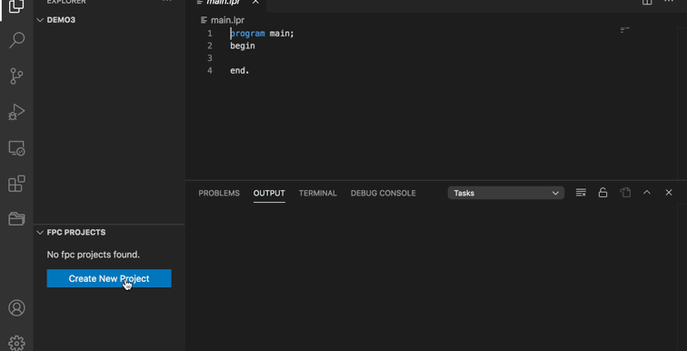

# FreePascal Toolkit 
`FreePascal Toolkit` is a VSCode extension for developing FreePascal applications.

## Requirements

- Install [FreePascal](https://www.freepascal.org/download.var) on your system. Then Set the system PATH environment variable, or set `fpctoolkit.env.PP` in vscode's user setting. 

- Install [GDB Debugger - Beyond](https://marketplace.visualstudio.com/items?itemName=coolchyni.beyond-debug) for  debug freepascal program .

## Features
- build freepascal program
- explorer build tasks
- code snippets
- auto completion
- gotoDeclaration, gotoDefinition
- class and function references 
- documentHighlight

## Pascal Language Server 

from [pascal-language-server](https://github.com/coolchyni/pascal-language-server)

An [LSP](https://microsoft.github.io/language-server-protocol/) server
implementation for Pascal variants that are supported by [Free
Pascal](https://www.freepascal.org/), including Object Pascal. It uses
[CodeTools](https://wiki.lazarus.freepascal.org/Codetools) from
Lazarus as backend.

## Freepascal Task Settings

You can add freepascal compile tasks by editing `task.json` in your .vscode folder.

The task's type is `fpc`. It contains the following configuration items.

### Task settings
Field   | type  |  Description  |
------  | ----- |  :-------------
`file`  | string|main program file
`type`  | string|always be `fpc`
`cwd`   | string|current path. Use wrokspace root if null.
`cleanExt`|string|file extensions for clean file in unitOutputDir. use * for clear all file. default:(.o,.ppu)
`buildOption`|object|build options

### buildOptions
Field  | type | Description  |
-------| ---- |:---------------
`targetOS`  | string | Target OS (-T).  eg. `linux` `win64`
`targetCPU` |tring| Target cpu family (-P). eg. `x86_64` `i386`
`customOptions`|string []| Any compile options for fpc.     
`libPath`|string[]|Searchpath for libraries.(-Fl)
`outputFile`| string| Target file name.(-o)
`unitOutputDir`| string|Unit output directory.(-FU)
`optimizationLevel`| number|Optimization levels (-O)
`searchPath`| string[]|Searchpath for units and other system dependent things.(-Fu)
`syntaxMode`| string|Syntax Mode (-M)

example:
~~~json
{
	"version": "2.0.0",
	"tasks": [
		{
			"label": "fpc:build:main",
			"file": "main.lpr",
			"type": "fpc",
			"buildOption": {
				"unitOutputDir": "./out",
				"customOptions": [
					"-dDEBUG"
				]
			}
		}
	]
}
~~~

## HighLight

syntaxes from https://github.com/maresmar/ST-Pascal

## Release Notes

[view changelog](CHANGELOG.md)

