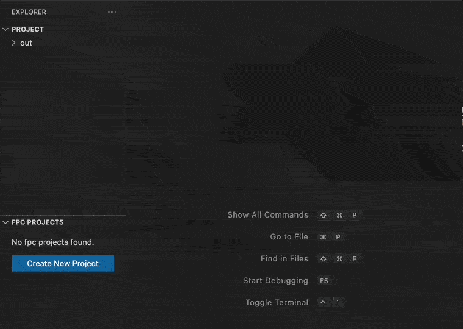
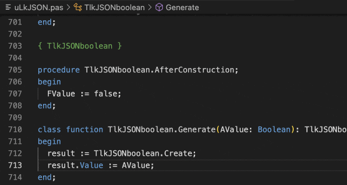
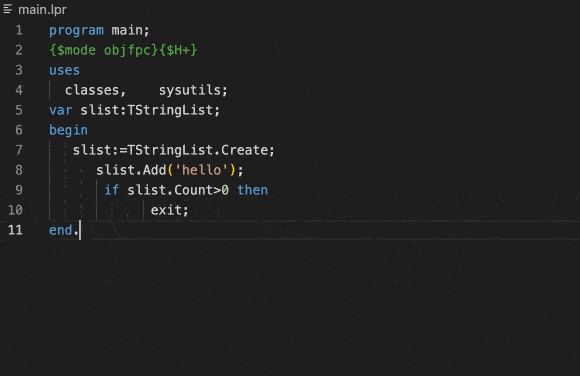
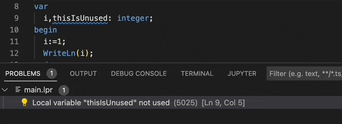

# FreePascal Toolkit 
`FreePascal Toolkit` 是一个用于开发FreePascal程序的 VSCode 应用扩展.

[English Document](README.md)
## 准备条件

- 安装 [Lazarus](https://www.lazarus-ide.org/) 或 [FreePascal](https://www.freepascal.org/download.var) . 
- 默认会自动搜索FPC路径，如果找不到，请设置FPC的路径为系统搜索路径，或者在插件里设置 `fpctoolkit.env.PP = FPC程序全路径`. 

- 安装并使用 [GDB Debugger - Beyond](https://marketplace.visualstudio.com/items?itemName=coolchyni.beyond-debug) 进行程序调试

## 功能列表
- 编译Free Pascal 程序
	- 构建项目
	- 清理和构建
	- 清理

- 可视化任务管理
	- 支持自定义任务
	- 支持从其他任务继承
- 快速代码模版
	- 包含非常多的代码模版，用于快速输入代码.
		* class
		* if-else
		* begin-end
		* ... 
- 智能代码补全，支持函数，过程，类，变量，关键字...
 
 	
 
- 代码快速导航
	- 使用 `ctrl+up`,`ctrl+down` 在函数声明和函数体之间快速跳转.
	- 快速访问类和函数定义
	
	 
	
- 语法高亮显示
	- 源代码高亮 
	- 能根据编译条件,将`{$IFDEF} {ELSE} {$ENDIF}`之间的无效代码半透明. 
- 代码格式化 
	
	- 使用[jcf cli](https://github.com/coolchyni/jcf-cli)格式化源代码
	- 使用 `jcfsettings.cfg` 作为配置文件。如果你已经安装了lazarus,本插件将自动使用其配置文件. 
	
	 
	
- 快速修复
	- 快速修复警告: `(5025) Local variable "xxx" not used`
	
	 

- 重命名函数，类，或变量名
	- 重命名将会自动更新其相关引用. 
- 代码自动完成 
	- 使用 `ctrl+shift+c` 自动实现函数体 .
- 源代码操作
	- 支持删除无用的单元声明

## Pascal Language Server 

[pascal-language-server](https://github.com/coolchyni/pascal-language-server)是一个[Free Pascal](https://www.freepascal.org/)实现的[LSP](https://microsoft.github.io/language-server-protocol/) 服务端程序。使用[Lazarus](https://www.lazarus-ide.org/)的[CodeTools](https://wiki.lazarus.freepascal.org/Codetools)作为后台。

## 任务设置

你可以在.vscode目录下编辑 `task.json` 文件来修改任务选项目。

任务类型为 `fpc`. 包含以下可用的配置项:

### Task 选项
字段   | 类型  |  描述  |
------  | ----- |  :-------------
file  | string|Free Pascal 项目文件. (.lpr,.dpr)
type  | string|必须是 `fpc`
cwd   | string|当前工作目录. 如果不设置默认使用vscode工作目录.
cleanExt|string|指定执行清理项目时需要清除的文件名后缀. 输入* 表示清除所有文件. 默认(.o,.ppu,.lfm,.a,.or,.res)
buildOption|object|build 选项
inherited|string| 被继承的任务名

### buildOptions
Field  | type | Description  |
-------| ---- |:---------------
targetOS  | string | 目标操作系统 (-T).  eg. `linux` `win64`
targetCPU |string| 目标CPU族 (-P). eg. `x86_64` `i386`
customOptions|string []| 自定义编译选项.     
libPath|string[]|库搜索路径.(-Fl)
outputFile| string| 目标文件名称.(-o)
unitOutputDir| string|单元文件输出路径.(-FU)
optimizationLevel| number|代码优化级别 (-O)
searchPath| string[]|单元文件搜索路径.(-Fu)
syntaxMode| string|语法模式 (-M {$mode})
forceRebuild| boolean|强制更新所有单元文件并编译.(-B)
msgIgnore|number[]|指定编译时哪些消息不需要显示.(-vmxxx)

配置示例:
~~~ json
{
	"version": "2.0.0",
	"tasks": [
		{
			"label": "debug",
			"file": "main.lpr",
			"type": "fpc",
			"buildOption": {
				"unitOutputDir": "./out",
				"customOptions": [
					"-dDEBUG",
					"-gw2"
				]
			}
		}
	]
}
~~~

# 致谢
## 语法高亮

语法文件来自于 https://github.com/maresmar/ST-Pascal

## 格式化

修改自  https://github.com/git-bee/jcf-cli

## Pascal-language-server

修改自
https://github.com/genericptr/pascal-language-server 
https://github.com/arjanadriaanse/pascal-language-server

# 发布说明

[查看更新记录](CHANGELOG.md)

